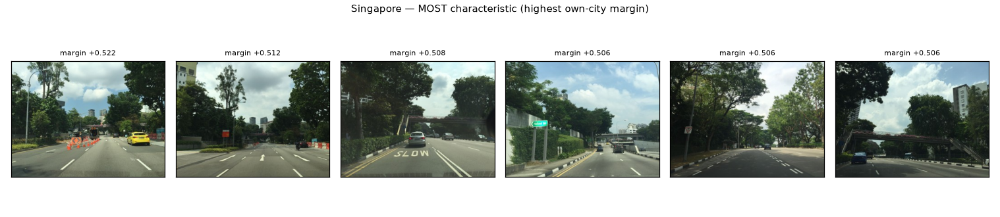
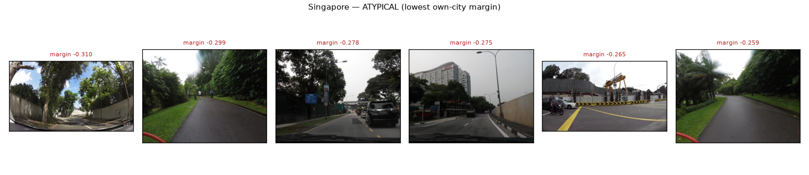

# Street Signatures — What Makes a City Look Like Itself?

**Learning and auditing visual city identity from ordinary street scenes**

[](https://colab.research.google.com/github/IvanFengJK/rdai-street-signature/blob/main/notebooks/street_signatures.ipynb)

> **Can a trained visual encoder discover what makes ordinary street scenes
> distinctive of a city — and can we distinguish genuine visual structure from
> dataset shortcuts?**

The second half of that question turned out to be most of the work.

---

## Why ordinary streets, not landmarks

Recognising Singapore from Marina Bay Sands is trivial and tells you nothing
about the city. Anyone who has walked an unfamiliar city recognises something in
the *everyday* street instead: the density of the tree canopy, how buildings
meet the pavement, the width and marking of the carriageway, the street
furniture, the quality of the light.

This project trains an encoder on ordinary street-level imagery and then asks
what visual patterns it associates with each city — while testing, at every
step, whether those patterns are about the city or about the camera that
happened to photograph it.

## Data and model

| | |
|---|---|
| **Dataset** | [NUS Global Streetscapes](https://huggingface.co/datasets/NUS-UAL/global-streetscapes) — 10M crowd-sourced street images, 688 cities |
| **Subset** | 20 cities across all six continents, distinct Köppen zones, **5,000 images each = 100,000** |
| **Model** | timm **ResNet50**, replaced head, `pretrained=False` — trained here from random init |
| **Pretext task** | city classification (20-way) |
| **Split** | **by sequence ID**, stratified per city, intersection asserted empty |
| **Excluded** | 360° panoramas (projection share is confounded with city) |
| **Never used** | the dataset's crowd-sourced perception scores (safety / wealth / beauty) |

**Why the sequence split matters.** Images arrive in *sequences* — consecutive
frames from one vehicle trip, metres apart, effectively near-duplicates. A
random split puts a frame in training and its twin in validation, and the model
scores well by recognising a photo it has already seen. Every number below would
be meaningless without this safeguard.

## Headline results

| Finding | Result |
|---|---|
| City classification, sequence-disjoint validation | **0.9089** vs 0.0500 chance |
| Reproducibility, two runs from one seed | **bit-identical** (every weight tensor) |
| Cross-city physical retrieval, city encoder | 0.1344 vs 0.1519 random — **fails** |
| VICReg (100 epochs) vs frozen ImageNet | **not significant**, CI crosses zero |
| City from **capture metadata alone**, no pixels | **0.9249** — *exceeds* the pixel model |
| **Clean cross-campaign, visual representation** | **0.8892** |
| Clean cross-campaign, metadata only | **0.1160** |
| Chance | **0.0500** |

The clean cross-campaign diagnostic uses **8,268 images the encoder never saw**,
from **1,350 sequences** across **19 cities**.

> **The dominant temporal/capture metadata confound does not explain the
> encoder's performance on the clean cross-campaign subset.**

That claim is deliberately narrow. It does **not** mean all capture or
contributor confounds are eliminated — see [Limitations](#limitations).

## What a city looks like, according to the model



Singapore's most *characteristic* streets — ordinary road corridors, not
landmarks: dense roadside canopy arching over multi-lane carriageways, mown
green verges, tropical planting, green directional signage. The model was never
told about vegetation.

Images are ranked by a **margin**, not by distance to the city average — because
distance alone rewards images that are merely *typical*, and a generic road looks
average everywhere. The margin asks how much more like its own city an image
looks than like its closest rival:

```
score(x) = cos(x, μ_own) − max_{c ≠ own} cos(x, μ_c)
```



The *atypical* end: park paths, construction hoarding, cluttered frontage.
Note several also show a **different capture platform** (fisheye distortion, a
bicycle handlebar cable at the frame edge) — the score is partly sensitive to
camera rig, not only to urban form.

## The experimental journey

The research question above is **not** the one the project started with. It
emerged from a chain of failures and self-corrections:

```
  city classification                       0.9089 vs 0.05 chance
        │
        ▼
  strong city clustering                    UMAP: 20 near-disjoint islands
        │
        ▼
  cross-city retrieval FAILS                0.1344 vs 0.1519 random
        │
        ▼
  VICReg ≈ frozen ImageNet                  54 GPU-h, not significant
        │
        ▼
  evaluation defect found in our own code   12/20 queries returned nothing
        │                                    → corrected as Stage 7b
        ▼
  metadata shortcut audit                   0.9249 without pixels (!)
        │                                    → accuracy alone proves nothing
        ▼
  first campaign test was CONTAMINATED      81% of the test set had been
        │                                    trained on → discarded
        ▼
  clean held-out result                     0.8892 vs 0.1160 metadata
        │
        ▼
  visual-signature analysis                 characteristic / atypical / modes
                                            + 14 of 60 modes flagged
```

Each arrow is a place where the honest answer changed what could be claimed.
None of these steps has been rewritten to make the story cleaner — the audit
trail is in [NOTES.md](NOTES.md).

## Conclusions

Three findings, which should not be collapsed into one.

1. **A city-supervised encoder learns a strongly city-discriminative
   representation.** 0.9089 against 0.05 chance, bit-reproducible. Cross-city
   neighbours are so scarce that a search must pass **1,000** candidates before
   even a third of queries find ten — against depth 50 for frozen ImageNet.

2. **That representation is poorly suited to cross-city physical similarity.**
   On the corrected evaluation it is barely better than random, and significantly
   worse than both frozen ImageNet and VICReg. Self-supervised training for 100
   epochs did **not** significantly beat untrained ImageNet features. City
   discrimination and cross-city similarity are close to opposed objectives.

3. **On genuinely unseen later imagery, substantial city-discriminative visual
   signal remains after the dominant metadata shortcut collapses** (0.8892 vs
   0.1160). This permits *cautious* inspection of the visual signatures the model
   associates with each city, while 14 of 60 modes remain visibly tied to capture
   artefacts.

### Claim ladder

**Supported** — the trained representation contains strong city-discriminative
visual information that transfers to genuinely unseen later-period imagery.

**Suggestive** — some ordinary street patterns are strongly associated with city
identity in the learned representation.

**Not established** — that the discovered patterns are causal, exhaustive,
uniquely intrinsic to a city, or free of every possible collection artefact.

## Limitations

- **Only 20 cities**, 5,000 images each. Nothing generalises to the full 688.
- **Collection and campaign bias is severe** — capture metadata alone predicts
  city at 0.9249. The cross-campaign diagnostic addresses the *temporal* part,
  not all of it.
- **Contributor identity is unavailable** in our cached fields, so a contributor
  using the same camera across both periods cannot be excluded. This is the most
  important unresolved confound.
- **"Characteristic" and "model-discovered" are not causal claims.**
- **Physical attributes explain only part of the embedding** — greenery, building
  density and road type are three coarse numbers.
- **Cross-city retrieval used only 20 queries**, hence wide intervals and the
  "not significant" verdict on VICReg.
- **Casablanca is absent from the clean cross-campaign test** (19 of 20 cities).
- **Panoramas excluded** — conclusions cover perspective and fisheye imagery only.

## Reproduction

The notebook runs top to bottom on a **Colab T4** and defaults to loading the
published checkpoint and cached embeddings.

```bash
git clone https://github.com/IvanFengJK/rdai-street-signature.git
cd rdai-street-signature
python -m venv .venv && .venv/bin/pip install -r requirements.txt
.venv/bin/python scripts/fetch_artifacts.py   # 1.28 GB, checksum-verified
.venv/bin/python -c "import torch; print(torch.__version__, torch.cuda.is_available())"
```

Large artifacts are **not in git**. The notebook fetches them automatically; see
[ARTIFACTS.md](ARTIFACTS.md) for sizes, checksums and how to regenerate each.

```bash
# rebuild the deliverable notebook (never hand-edit the .ipynb)
.venv/bin/python scripts/build_notebook.py
```

`TRAIN_FROM_SCRATCH = False` loads published results. Set it to `True` to
genuinely retrain on a T4 with the reduced config in `config.yaml`; that shorter
run will not reproduce the headline numbers, and says so.

## Repository map

| Path | What it is |
|---|---|
| [notebooks/street_signatures.ipynb](notebooks/street_signatures.ipynb) | **the deliverable** — reproducible walkthrough |
| [NOTES.md](NOTES.md) | the audit trail: every experiment, mistake and correction |
| [REFERENCES.md](REFERENCES.md) | related work and how this project sits against it |
| [ARTIFACTS.md](ARTIFACTS.md) | reproduction manifest for the non-git files |
| `outputs/final/` | the figures and tables a reader actually needs |
| `src/` | all modules; `config.yaml` drives everything |
| `scripts/` | one runner per stage, in historical order |
| `schema.json` | verified column names — nothing is guessed |

`src/` layout: `data` `dataset` `model` `train` `embed` `retrieval`
`retrieval_corrected` `signatures` `probe` `viz` `vicreg` `ssl_model`
`ssl_dataset` `train_ssl` `imagery` `schema`.

## Licence and attribution

Imagery from Mapillary and KartaView via NUS Global Streetscapes, under their
respective terms. This repository contains code and derived analysis only — no
redistributed imagery.
